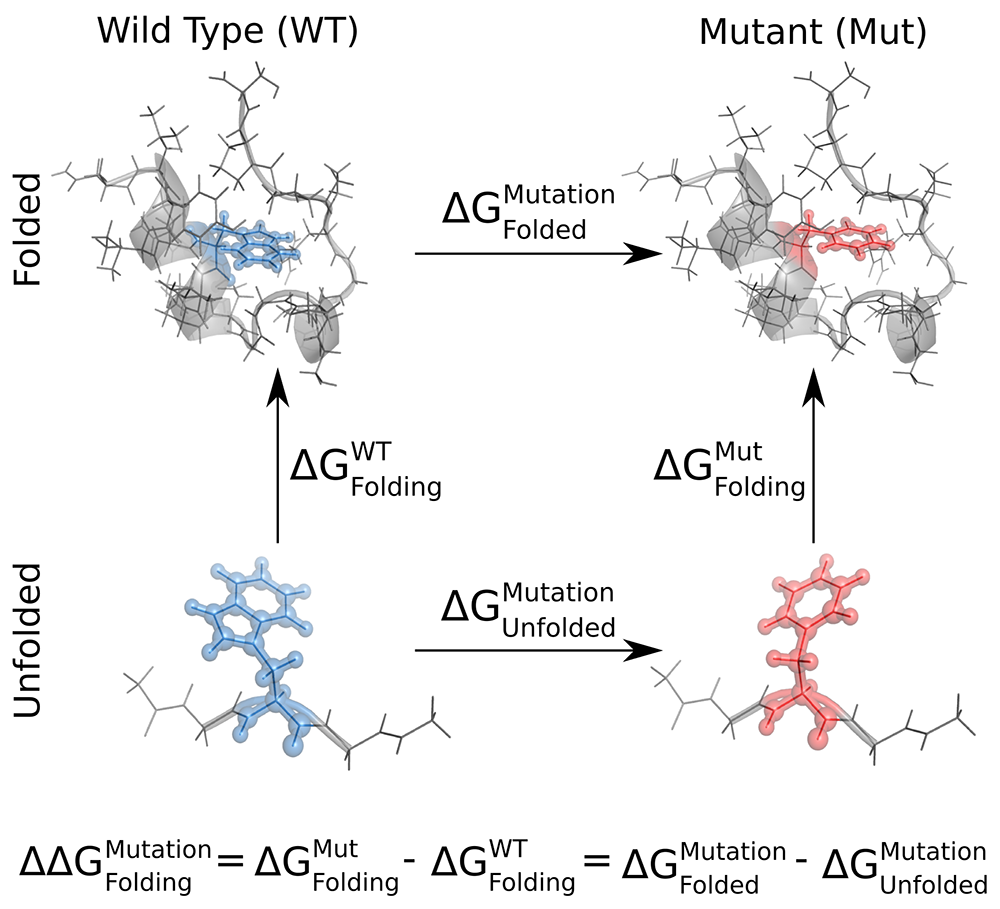

Protein mutation
================

In this tutorial we will show how **pmx** can be used to predict changes in
protein stability, similarly to what was done in `Gapsys et al <https://onlinelibrary.wiley.com/doi/abs/10.1002/anie.201510054>`_.
All input files needed for this tutorial can be downloaded here: [link2input].

In order to calculate how a mutation affects the folding free energy of a protein
(:math:`\Delta \Delta G_{Folding}^{Mutation}`),
we need to calculate the free energy difference of
*alchemically* mutating both the folded and unfolded state of the protein (:math:`\Delta G_{Folded}^{Mutation} - \Delta G_{Unfolded}^{Mutation}`).
Effectively, we use the following thermodynamic cycle to recover :math:`\Delta \Delta G`
via the non-physical transformations shown as the horizontal legs of the cycle.

Here, we will go through the steps for the calculation of :math:`\Delta G_{Folded}^{Mutation}`,
using the ``protein.pdb`` file provided. :math:`\Delta G_{Unfolded}^{Mutation}` can be
obtained by following exactly the same steps, but using the file ``tripeptide.pdb``
as the starting structure. These input ``pdb`` files have already been processed
so to contain hydrogen atoms and *amber* atom names.

Preparation of hybrid files
---------------------------

As an example system, here we use the *Trp-cage* miniprotein (file ``protein.pdb``).
Firstly, we need to create a structure file containing the correct hybrid residue
needed for the mutation of interest. This can be done using the ``pmx mutate`` script::

    $ pmx mutate -f protein.pdb -o mutant.pdb

The script will ask what force field you would like to use; to get the same results as
we report here, choose the *amber99sb-star-ildn-mut* one. Then, choose to mutate the Trp6 (W6) residue
into Phe (F).

Next, to create the corresponding topology to this hybrid structure, you need to
use the ``gmx`` tool ``pdb2gmx`` using the same force field you previously chose::

    $ gmx pdb2gmx -f mutant.pdb -o conf.pdb -p topol.top -ff amber99sb-star-ildn-mut -water tip3p

The output topology ``topol.top`` contains the hybrid residue W6F, like the structure
file ``conf.pdb``. However, the B-state columns do not yet contain the right
information for Gromacs to run the calculations. To fill the B-states with the
necessary data, you can use the ``pmx gentop`` script::

    $ pmx gentop -p topol.top -o newtop.top

Now with the ``conf.pdb`` and ``newtop.top`` files you are ready to setup the system
as you would do for a typical Gromacs simulation.

The steps just described can also be performed using the **pmx webserver**,
which you can find in the navigation bar on the left. Alternatively, you can
automate the above steps in a script using the **pmx** API as shown here and
also discussed in :ref:`the examples <examples>`::

    #! /usr/bin/env python

    from pmx import *

    # load, mutate, and save the PDB file
    m = Model('peptide.pdb', for_gmx=True)
    m2 = mutate(m=m, mut_resid=6, mut_resname='F', ff='amber99sb-star-ildn-mut')
    m2.write('mutant.pdb')

    # run pdb2gmx
    gmx.pdb2gmx(f='mutant.pdb', o='conf.pdb', p='topol.top', ff='amber99sb-star-ildn-mut',
                water='tip3p')

    # load topology, fill B states, then write a new topology file
    topol = Topology('topol.top')
    pmxtop, _ = gen_hybrid_top(topol)
    pmxtop.write('newtop.top')

System setup
------------
Now we are ready to set up the system to be simulated in Gromacs. The following
are the standard steps used in any Gromacs simulation; you can find a more detailed
explaination of these steps in `this tutorial <http://www.bevanlab.biochem.vt.edu/Pages/Personal/justin/gmx-tutorials/lysozyme/index.html>`_. ::

    $ gmx editconf -f conf.pdb -o box.pdb -bt dodecahedron -d 1.0
    $ gmx solvate -cp box -cs spc216 -p newtop -o water.pdb
    $ gmx grompp -f genion.mdp -c water.pdb -p newtop.top -o genion.tpr
    $ echo "SOL" | gmx genion -s genion.tpr -p newtop.top -neutral -conc 0.15 -o ions.pdb

Now we have the file ``ions.pdb`` containing our protein, solvated in a dodecahedral
box and with Na and Cl ions neutralising the solution at a concentration of 150 mM.
These setup steps can also be automated using the :mod:`pmx.gmx` module: ::

    from pmx import gmx

    gmx.editconf(f='conf.pdb', o='box.pdb', bt='dodecahedron', d=1.0)
    gmx.solvate(cp='box.pdb', cs='spc216', p='newtop.top', o='water.pdb')
    gmx.grompp(f='em.mdp', c='water.pdb', p='newtop.top', o='genion.tpr')
    gmx.genion(s='genion.tpr', p='newtop.top', neutral=True, conc=0.15, o='ions.pdb')

Equilibrium MD
--------------
At this stage, we are ready to start simulating the system. What we need to do
is to collect equilibrium configurations of the system in both its two end states;
i.e. state A in which residue 6 is a Trp, and state B in which it is Phe. Thus,
we will run energy minimisation, a short equilibration, and the production equilibrium MD
for both the end states. To keep things tidy, we use the following folder structure,
which should already be prepared in the archive with the input files you downloaded
at the top of this page. ::

    pwd/
    |
     -- forward/
    |   |
    |    -- equil_md/
    |   |
    |    -- nonequil_md/
    |
     -- reverse/
        |
         -- equil_md/
        |
         -- nonequil_md/

where ``pwd`` is the current working directory where you have setup the system,
``forward`` is the folder that will contain the equilibrium and non-equilibrium
data concerning the forward transformation (:math:`T6 \to F6`), and
``reverse`` the folder with the data concerning the reverse transformation
(:math:`F6 \to T6`).

These are not very intensive simulations, so you might be able to run them on
your workstation if you have a GPU. However, they might still take some time (e.g. 2-3 hours), so
you might want to go get a coffee or submit them to a cluster and work on something else
in the meantime.

We start with running the equilibrium simulations needed for the forward transformation.
First we go into the relevant folder::

    $ cd forward/equil_md

Then, we run the minimisation::

    $ gmx grompp -f f_enmin.mdp -c ../../ions.pdb -p ../../newtop.top -o enmin.tpr
    $ gmx mdrun -s enmin.tpr -deffnm enmin -v

The equilibration with position restraints::

    $ gmx grompp -f f_npt.mdp -c enmin.gro -p ../../newtop.top -o npt.tpr -maxwarn 1
    $ gmx mdrun -s npt.tpr -deffnm npt -v

And finally the actual equilibrium MD run::

    $ gmx grompp -f f_equil.mdp -c npt.gro -p ../../newtop.top -o equil.tpr -maxwarn 1
    $ gmx mdrun -s equil.tpr -deffnm equil -v

Now we have the equilibrium sampling needed for *the forward* transformation. For the
reverse one, we do exactly the same from the ``reverse/equil_md`` folder and using
the *reverse* mdp files (``r_*.mdp``) you find in it. Note that the only difference
in the *forward* and *reverse* mdp files is whether we choose to be in state *A*
(i.e. *0*, and in this case W6) or state *B* (i.e. *1*, F6)::

    # this is in the forward (f_*) mdp files
    free-energy       = yes  ; use free energy code
    init-lambda       = 0    ; start from state A
    delta-lambda      = 0    ; stay in state A

    # and this is in the reverse (r_*) mdp files
    free-energy       = yes  ; use free energy code
    init-lambda       = 1    ; start from state B
    delta-lambda      = 0    ; stay in state B

As before, these steps can be automated using the :mod:`pmx.gmx` module. Nonetheless,
in practice, if you need to run many or more demanding calculations (e.g. longer/more
simulations of larger systems) you will probably do this on some computing cluster, so
that you will find more convenient to include the above steps in your submit script.

Non-equilibrium MD
------------------

Once we have collected equilibrium samples of the systems of interest, we can
move on with the non-equilibrium part of the calculations, which will provide
the work values needed for the free energy estimate.

For this, we move into the ``forward/nonequil_md`` folder::

    $ cd ../../forward/nonequil_md/

Then, we extract 50 snapshots from the 5 ns equilibrium simulation (i.e. one every 100 ps,
starting with the one at 100 ps) using ``gmx trjconv``::

    $ echo "System" | gmx trjconv -f ../equil_md/equil.trr -s ../equil_md/equil.tpr -sep -b 100 -o frame_.gro

The ``.trr`` file is used so that the starting snapshots contain
the velocities from the equilibrium sampling. At this point you should have 50 ``gro`` files
in the folder, indexed from 0 to 49. Now we create a folder for each starting frame,
so to have a different folder (index from 1 to 50) for each non-equilibrium trajectory::

    $ for i in $( seq 0 49 ); do n=$((i+1)); mkdir frame$n; mv frame_$i.gro frame$n/frame.gro; done

Now you are ready to run 50 non-equilibrium forward transitions starting from
these frames. The length of each non-equilibrium trajectory we use here is 80 ps;
however, depending on the specifics of the system, you might need to use longer
trajectories or you might get away with shorter ones (see the :ref:`analysis tutorial <tutorial_analysis>` for
more details on this). The important/non-standard bit in the ``f_nonequil.mdp`` file
is the following::

    free-energy       = yes
    init-lambda       = 0        ; start from state A
    delta-lambda      = 2.5e-05  ; complete transition in this number of steps
    sc-coul           = yes   ; use soft-core also for coulombic interactions
    sc-alpha          = 0.3   ; soft-core
    sc-sigma          = 0.25  ;
    sc-power          = 1     ;
    nstdhdl           = 1     ; write to dhdl at each step

which effectively says to use the free energy code, to go from state :math:`0` to :math:`1` in
:math:`40,000` steps of size :math:`2.5 \times 10^{-5}`, and to use a
soft-core potential for both Lennard-Jones and Coulombic interactions.

Depending on your computing setup/situation, you can run these simulations in parallel or one after
the other one. Here, we run them locally and in series in this way::

    $ for i in $( seq 1 50 ); do
    $   cd frame$i
    $   gmx grompp -f ../f_nonequil.mdp -c frame.gro -p ../../../newtop.top -o nonequil.tpr -maxwarn 1
    $   gmx mdrun -s nonequil.tpr -deffnm nonequil -dhdl dgdl.xvg -v
    $   cd ../
    $ done

The files you really need for the free energy estimate are the ``dgdl.xvg`` files.
You need these also for the reverse transformation, which you can obtain by
going through the same steps described here while using the files in the ``reverse``
folder. The ``r_nonequil.mdp`` file you will use is the same as the ``f_nonequil.mdp``
file, apart from the two following lines::

    init-lambda       = 1        ; start from state B
    delta-lambda      = -2.5e-05 ; complete transition in this number of steps

Since in the reverse case we need to start from state :math:`1` (i.e. B, F6) and
go to state :math:`0` (i.e. A, W6).

Free energy estimation
----------------------

Great! Now we have all the data needed for estimating :math:`\Delta G_{Folded}^{Mutation}`,
which is stored in the ``forward/nonequil_md/frame*/dgdl.xvg`` and
``reverse/nonequil_md/frame*/dgdl.xvg`` files.

The simplest way to estimate the free energy difference is to use the ``pmx analyse``
tool. For instance, here we use it to estimate :math:`\Delta G_{Folded}^{Mutation}`
with BAR::

    $ pmx analyse

For a more detailed discussion about free energy estimation and data analysis you
can have a look at the :ref:`analysis tutorial <tutorial_analysis>`. In brief,
for this calculation, this is the distribution of work values and the BAR
:math:`\Delta G` estimate we obtained.

    here image

Often, the easiest way to get reliable error estimates is to just repeat the
whole calculation multiple times to obtain a standard error. For this example,
we repeated the above steps 5 times, and obtained the following mean and standard error:

.. math:: \Delta G_{Folded}^{Mutation} = 10 \pm 1\ kJ/mol

Final results
-------------

At this point, if you still remember, the number we were interested in was :math:`\Delta \Delta G_{Folding}^{Mutation}`,
that is, the change in the folding free energy upon introducing the W6F mutation.
This values is recovered from :math:`\Delta G_{Folded}^{Mutation}`, which we just
calculated, and :math:`\Delta G_{Unfolded}^{Mutation}`, which you can obtain by running
the calculations starting from ``tripeptide.pdb`` file rather than ``protein.pdb``.
Using 5 repeats, we obtained the following mean and standard error for the latter
free energy difference:

.. math:: \Delta G_{Unfolded}^{Mutation} = 10 \pm 1\ kJ/mol

Thus, our final result of interest is the following:

.. math::

    \Delta \Delta G_{Folding}^{Mutation} &= \Delta G_{Folded}^{Mutation} - \Delta G_{Unfolded}^{Mutation} = \\
                                         &= 10 \pm 1\ - 10 \pm 1 =  \\
                                         &= 10 \pm 1\ kJ/mol

This suggests that the W6F mutation has a destabilising effect on the fold of
Trp-cage of about XXX kJ/mol, in agreement with the experimentally determined
value of YYYY kJ/mol.
